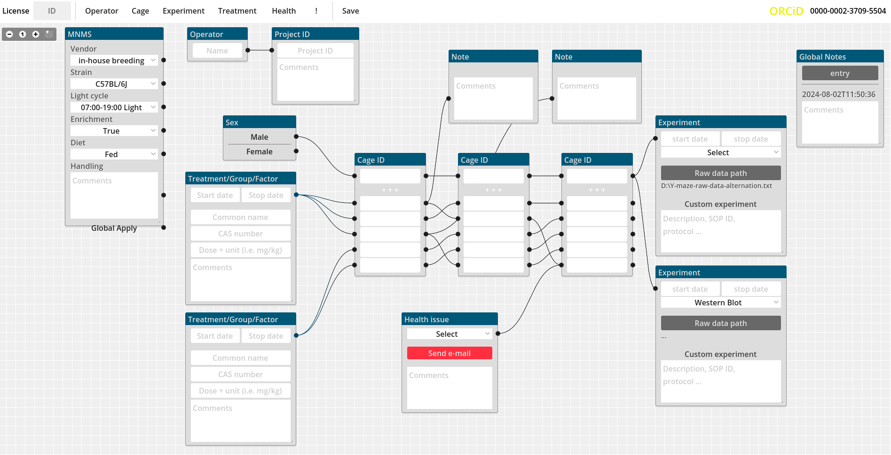

# Metadata-app

GUI for managing MNMS-compliant metadata

<mark> _2024-08-30_: Please note that the project is undergoing heavy refactoring and it **will soon be branched out to Version 2.0**. The current interface does not scale well to scenarios with more than 6 cages.</mark>

 

> Please review the [the code of conduct](CODE_OF_CONDUCT.md) to understand how to behave properly here and follow the [contributing guidelines](CONTRIBUTING.md).

## TO DO

- [PRIORITY] Highlight downstream information upon clicking a field
- [PRIORITY] Experiment timeline design (connect treatment and experiment to visualize timeline)
- [CRITICAL] Add global layer (save, load, clear, lock)
- [CRITICAL] Audit logging of changes
- [CRITICAL] connect cage IDs to assign the cages to the same group/treatment
- [CRITICAL] Import data (_.csv_, ._xls_) from AMS export
- Imported cages should reuce their node size based on the number of subjects present in the cage
- Global stats (cages/subjects per treatment/experiment)
- Export the data as JSON-LD
- Offset newly created windows
- Limit number of windows that can be created

## Wishlist
- [PRIORITY] Context menu to create node on the fly in specific positions
- Connect to ontology lookup service (<https://www.ebi.ac.uk/ols4>) or OntoBee (<https://ontobee.org/>)
- Enable random allocation of subjects to condition
- Use llm-to-SQL for grouping subjects

## Notes

### 2024-05-25

#### llm queries

Hookup a local llm to the inserted data. the data composed via the interface is exported as structured data. llm reads the data and answers the query via generation of retrieval strings. queries result in "hooks" that can be used to select/filter (visually) the data in the graphical interface. An additional window shows the textual result of the query

#### Analysis

Quality controls could be performed automatically, while follow-up analyses may be composed using the `nodegraphs` nodes 

### 2024-06-12

#### Highlight downstream information

Clicking on the title of a window highlights all the downstream connected nodes. all nodes downstream of cage nodes then display the number of subjects that get input from the clicked node and the title of the clicked node is displayed in the downstream results.

Multiple selections could be displayed as a popup table

***

### Colors

_2024-06-20_: Color scheme has been changed to `light`

#### Light color scheme
- Blue:  #005878 (title bar)
- Gray:  #dddddd (panel background)
- White: #ffffff (empty fields)
- Red:   #ff2f40 (highlight/alert)
- Black: #222222

##### Optional
- Green: #709124

### References
- <https://en.wikipedia.org/wiki/Laboratory_information_management_system>
- <https://en.wikipedia.org/wiki/List_of_LIMS_software_packages>
- excellent resource for graphnodes: <https://gdscript.com/solutions/godot-graphnode-and-graphedit-tutorial/>
