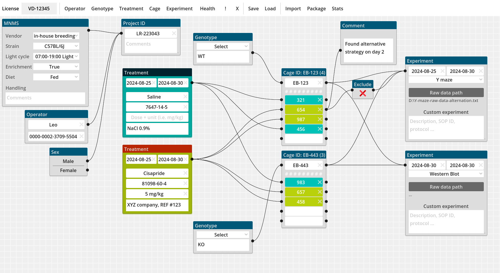

# Metadata-app

GUI for managing MNMS-compliant metadata

> Please review the [the code of conduct](CODE_OF_CONDUCT.md) to understand how to behave properly here and follow the [contributing guidelines](CONTRIBUTING.md).

## TO DO

- [CRITICAL] Add global layer (save, load, clear, lock)
- [CRITICAL] Audit logging of changes!
- [2024-05-28] Import data (_.csv_, ._xls_) from AMS export
- connect cage IDs to assign the cages to the same group/treatment
- Export the data as JSON-LD
- Offset newly created windows
- Limit number of windows that can be created
- Duplicate a cage
- right click to delete node
- Cage-to-cage connection should be allowed to enable mouse transfer between cages (or cage splitting)

## Wishlist
- Use llm-to-SQL for grouping subjects
- Connect to ontology lookup service (<https://www.ebi.ac.uk/ols4>) or OntoBee (<https://ontobee.org/>)
- Enable random allocation of subjects to condition
- Highlight downstream information upon clicking a field
- [PRIORITY] context menu to create node on the fly in specific positions

## Notes

### 2024-05-25

#### llm queries

Hookup a local llm to the inserted data. the data composed via the interface is exported as structured data. llm reads the data and answers the query via generation of retrieval strings. queries result in "hooks" that can be used to select/filter (visually) the data in the graphical interface. An additional window shows the textual result of the query

#### Analysis

Quality controls could be performed automatically, while follow-up analyses may be composed using the `nodegraphs` nodes 

### 2024-06-12

#### Highlight downstream information

Clicking on the title of a window highlights all the downstream connected nodes. all nodes downstream of cage nodes then display the number of subjects that get input from the clicked node and the title of the clicked node is displayed in the downstream results.

Multiple selections could be displayed as a popup table

***

### Colors

_2024-06-20_: Color scheme has been changed to `light`

- Blue:  #005878
- Green: #709124
- Red:   #ff2f40
- White: #efefef
- Black: #222222

### References
- <https://en.wikipedia.org/wiki/Laboratory_information_management_system>
- <https://en.wikipedia.org/wiki/List_of_LIMS_software_packages>
- excellent resource for graphnodes: <https://gdscript.com/solutions/godot-graphnode-and-graphedit-tutorial/>
